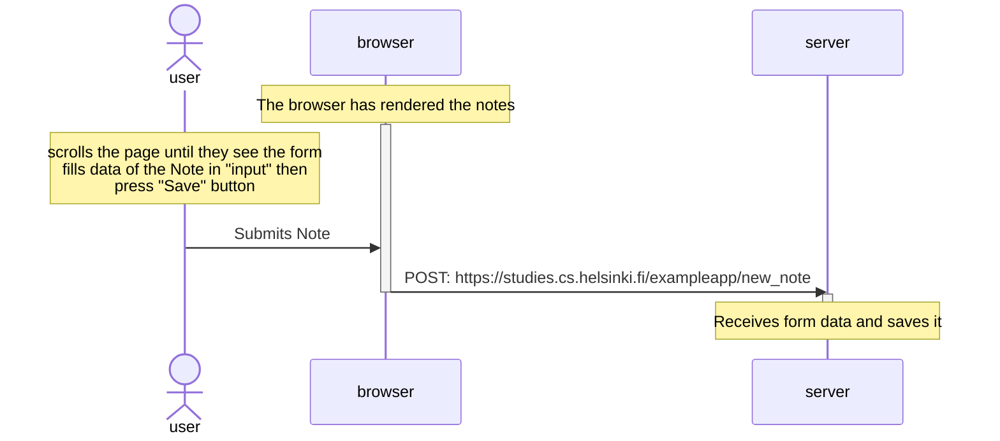

```mermaid
sequenceDiagram
    actor user
    participant browser
    participant server

    Note over browser: The browser has rendered the notes
    activate browser
    Note over user: scrolls the page until they see the form<br/>fills data of the Note in "input" then <br/>press "Save" button
    user->>browser: Submits Note
    browser->>server: POST: https://studies.cs.helsinki.fi/exampleapp/new_note
    deactivate browser
    activate server
    Note over server: Receives form data and saves it
    deactivate server
```