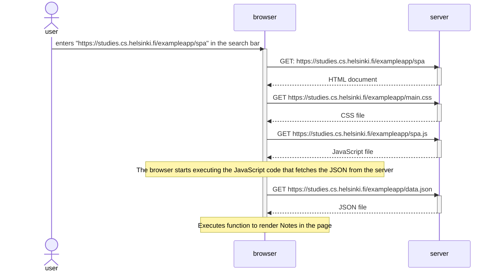

```mermaid
sequenceDiagram
    actor user
    participant browser
    participant server

    user->>browser: enters "https://studies.cs.helsinki.fi/exampleapp/spa" in the search bar
    activate browser
    browser->>server: GET: https://studies.cs.helsinki.fi/exampleapp/spa

    activate server
    server-->>browser: HTML document
    deactivate server

    browser->>server: GET https://studies.cs.helsinki.fi/exampleapp/main.css
    activate server
    server-->>browser: CSS file
    deactivate server

    browser->>server: GET https://studies.cs.helsinki.fi/exampleapp/spa.js
    activate server
    server-->>browser: JavaScript file
    deactivate server

    Note over browser: The browser starts executing the JavaScript code that fetches the JSON from the server

    browser->>server: GET https://studies.cs.helsinki.fi/exampleapp/data.json
    activate server
    server-->>browser: JSON file
    deactivate server

    Note over browser: Executes function to render Notes in the page
    deactivate browser
```